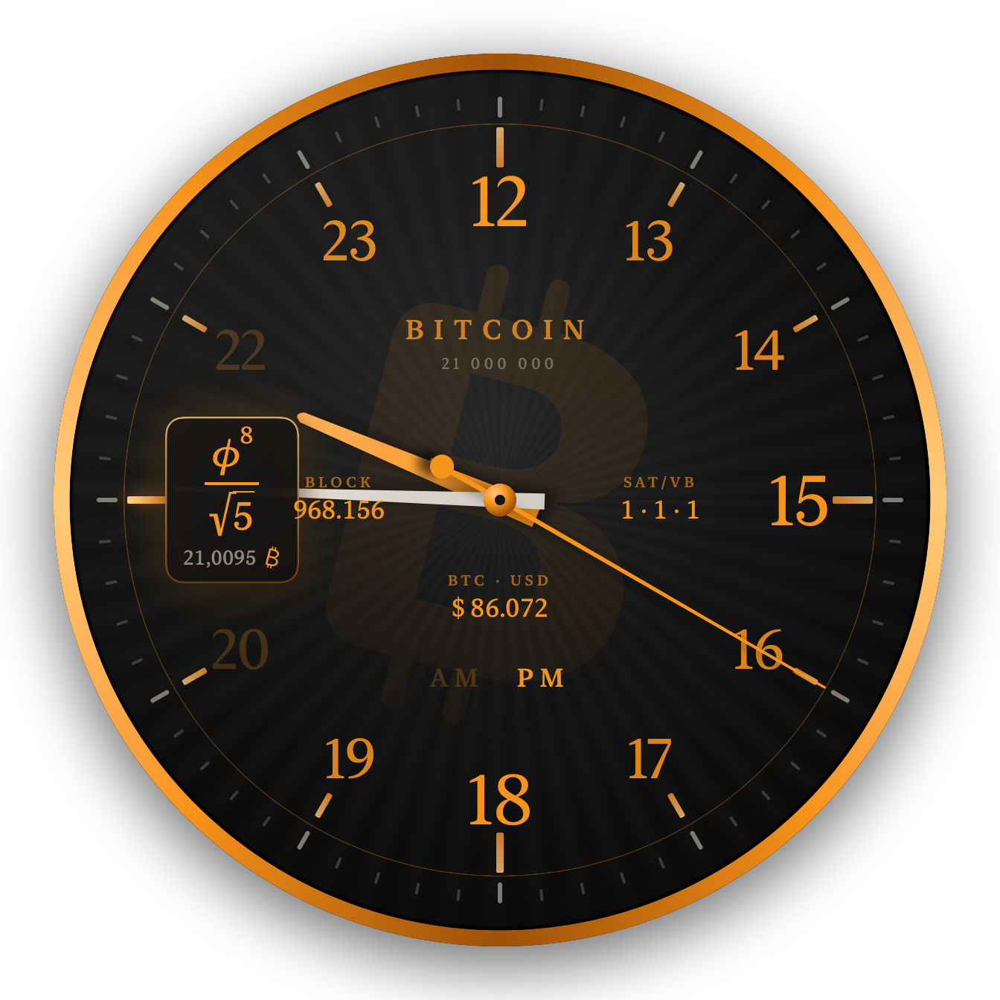
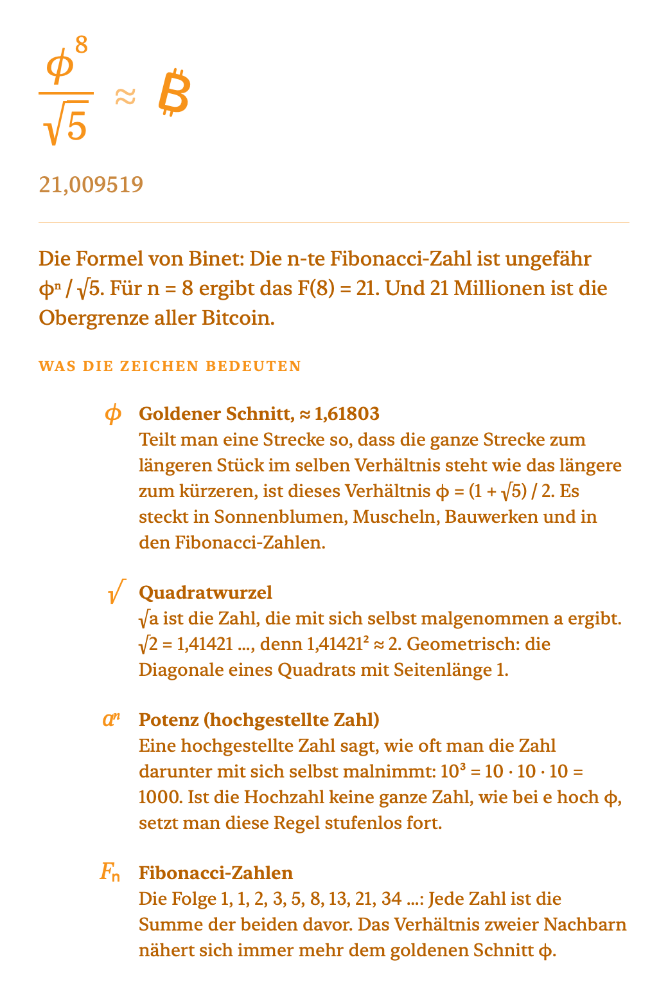

# Bitcoin-Uhr

Eine analoge Schreibtischuhr für macOS in Bitcoin-Orange. Auf den 5-Minuten-Strichen erscheinen mathematische Formeln, deren Wert gerundet die Stunde ergibt. Um 21 Uhr steht dort das ₿. Live-Daten von [mempool.space](https://mempool.space) zeigt die Uhr als schlichte Textanzeigen auf dem Zifferblatt.

*An analog macOS desktop clock in Bitcoin orange with math formulas on the hour marks and live data from mempool.space. UI in German.*

<p align="center"></p>

Die Idee stammt von der „mathematical clock“ von [@Math_files](https://x.com/Math_files/status/2102353716305170664) und wurde hier auf 24 Formeln erweitert.

Ein privates Hobbyprojekt, kein Produkt: kein Geschäftsmodell, kein Support-Versprechen. Mehr dazu, mit Bildern und allen Formeln, auf **[librarycompass.com/bitcoin-uhr](https://librarycompass.com/bitcoin-uhr/)**.

## Was sie kann

- **12-Stunden-Blatt mit AM/PM.** Vormittags stehen 1–11 auf dem Blatt, nachmittags 13–23. Nachmittags steht an der Stelle der 9 das ₿ für 21 Uhr, dazu ein ₿ als Wasserzeichen.
- **Formeln auf den 5-Minuten-Strichen.** Steht der Minutenzeiger genau auf einem Strich, ersetzt ein Schild die Zahl dort durch eine Formel, etwa e^π − π ≈ 20 oder φ⁸/√5 ≈ 21. Ein Klick darauf öffnet eine Erklärung, die auch jedes vorkommende Zeichen erklärt (π, e, φ, Bogenmaß …).
- **Komplikationen von mempool.space.** Vier Plätze zeigen wahlweise Blockhöhe, Gebühren, Preis in USD oder EUR, wartende Transaktionen, Blöcke bis zum Halving oder die nächste Difficulty-Anpassung. Ein Klick öffnet eine Erklärung in einfacher Sprache, von dort geht es auf Wunsch zu mempool.space.
- **Alles per Rechtsklick einstellbar:** Größe, Sekundenzeiger mit CPU-Stufe (aus, harter Sprung, weicher Sprung, gleitend), Formeln, Wasserzeichen, AM/PM, Komplikationen je Platz, Aktualisierungsintervall, Ebene („Über allen Fenstern“) und Autostart.
- **Sparsam.** Die Zeiger dreht Core Animation, die App selbst braucht im Betrieb praktisch keine CPU.

<p align="center">
  
  
</p>

## Bauen und installieren

Voraussetzungen: macOS 14 oder neuer und die Swift-Toolchain (Xcode oder die Command Line Tools).

```bash
git clone https://github.com/JoeMartinBTC/Bitcoin_clock.git
cd Bitcoin_clock
bash Scripts/build_local_app.sh
```

Das Skript baut die App, erzeugt das Symbol, signiert ad hoc, installiert nach `/Applications/BitcoinUhr.app` und startet sie. Beim ersten Start trägt sich die Uhr als Anmeldeobjekt ein. Das lässt sich per Rechtsklick wieder abschalten.

## Bedienung

Die Uhr hat kein Fenster mit Knöpfen und kein Symbol im Dock. Alles läuft über die Maus direkt auf dem Zifferblatt.

1. **Verschieben:** Mit der linken Maustaste auf die Uhr klicken und ziehen. Sie merkt sich ihren Platz, auch über einen Neustart hinweg.
2. **Einstellen:** Rechtsklick auf die Uhr öffnet das Menü. Jede Einstellung wirkt sofort und bleibt gespeichert.
3. **Formel verstehen:** Zu jeder vollen fünften Minute erscheint eine Formel. Ein Klick darauf öffnet ein Fenster mit Rechenweg und der Bedeutung jedes Zeichens.
4. **Daten verstehen:** Ein Klick auf Blockhöhe, Gebühren oder Kurs öffnet zuerst eine Erklärung für Einsteiger. Von dort führt ein Knopf auf Wunsch zu mempool.space.

Das Rechtsklick-Menü im Einzelnen:

| Eintrag | Was er tut |
|---|---|
| Größe | Klein, Mittel, Groß, Sehr groß (260 bis 640 Punkte). Die Uhr wächst um ihre Mitte. |
| Sekundenzeiger (CPU-Last) | Aus (keine Last), harter Sprung (voreingestellt, minimale Last), weicher Sprung, gleitend (höchste Last). |
| Anzeige | Formeln, ₿-Wasserzeichen und AM/PM einzeln ein- und ausschalten. |
| Komplikationen (mempool.space) | Für jeden der vier Plätze (oben, links, rechts, unten) den Inhalt wählen oder „Aus“. Dazu das Intervall (jede Minute, alle 5 oder alle 15 Minuten) und „Jetzt aktualisieren“. |
| Über allen Fenstern | Normal liegt die Uhr auf dem Schreibtisch unter allen Fenstern, hiermit vor ihnen. |
| Beim Anmelden starten | Autostart an oder aus. |
| Bitcoin-Uhr beenden | Beendet die Uhr. |

## Datenschutz

Die Uhr sammelt nichts und sendet nichts. Sie ruft nur die öffentliche API von mempool.space ab, und nur für die Komplikationen, die gerade sichtbar sind. Sind alle ausgeschaltet, gibt es keinen Netzverkehr.

## Mitmachen

Die Uhr ist ein Anfang, kein fertiges Produkt. **Baut sie weiter.** Wer eine Idee hat, forkt das Repository, probiert sie aus und schickt einen Pull Request. Auch ein Issue mit einer guten Idee ist ein Beitrag. Der Code ist klein und in SwiftUI geschrieben, der Einstieg gelingt an einem Abend.

Ideen, die noch niemand gebaut hat:

- Weitere Komplikationen: Hashrate, Sats pro Euro, Lightning-Kapazität, Zeit seit dem letzten Block
- Eine englische Oberfläche und weitere Sprachen
- Neue Formeln oder ganze Formelsätze zum Umschalten
- Andere Zifferblätter und Farben, etwa ein helles Blatt
- Ein echtes macOS-Widget für die Mitteilungszentrale
- Die Uhr als Bildschirmschoner oder als iPhone-App
- Ein Wecker, der zum nächsten Halving klingelt
- Eine eigene Node statt mempool.space als Datenquelle

Wo was liegt:

| Datei | Inhalt |
|---|---|
| `Sources/BitcoinUhr/ClockView.swift` | Zifferblatt, Beschriftung, Formel-Schilder, Rechtsklick-Menü |
| `Sources/BitcoinUhr/HandsLayerView.swift` | Zeiger als Core-Animation-Ebenen |
| `Sources/BitcoinUhr/MathExpr.swift` | die 24 Formeln und ihr Formelsatz |
| `Sources/BitcoinUhr/Explanations.swift` | Erklärtexte zu Formeln und Zeichen |
| `Sources/BitcoinUhr/Mempool.swift` | Abfrage von mempool.space, die Komplikationen |
| `Sources/BitcoinUhr/ComplicationInfo.swift` | Erklärfenster zu den Komplikationen |
| `Sources/BitcoinUhr/AppDelegate.swift` | Fenster, Klicks, Einstellungen, Autostart |

Zum Ausprobieren ohne Installation rendert `BitcoinUhr --snapshot <ordner> 21:45:00` das Zifferblatt und die Erklärfenster als PNG.

## Lizenz

[MIT](LICENSE)
